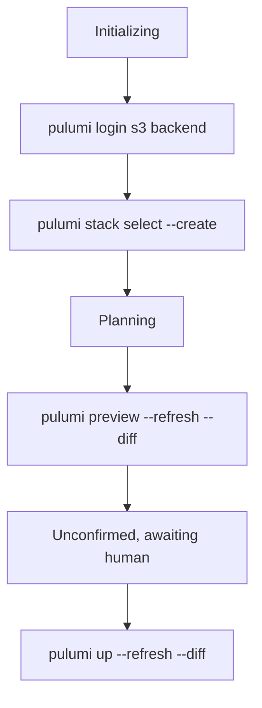

# Pulumi TypeScript on AWS (S3 bucket)

A minimal Pulumi program that creates one encrypted, private S3 bucket.
It exists to demonstrate the Spacelift GitOps workflow against the **Pulumi** vendor, not to host anything.

The Spacelift stack is defined in `admin/stacks_pulumi_aws.tf` as `pulumi-aws-s3`, in the `aws/pulumi` space.

## What it deploys

| Resource | Notes |
| --- | --- |
| `aws.s3.Bucket` | Name from the `bucketName` config, `forceDestroy` on so teardown works |
| `aws.s3.BucketVersioning` | Driven by the `versioningEnabled` config knob |
| `aws.s3.BucketServerSideEncryptionConfiguration` | AES256 with a bucket key |
| `aws.s3.BucketPublicAccessBlock` | All four blocks on |

## Prerequisites

These have to be true before the first run, or the stack fails at initialize.

1. **The state backend bucket must exist.**
   Spacelift does not store Pulumi state.
   The stack points `login_url` at `s3://spacelift-solutions-demo-pulumi-state`, which is created by `opentofu/aws/s3/pulumi_state_bucket.tf`.
   Apply the `opentofu-aws-s3` stack before the first Pulumi run.

2. **`PULUMI_CONFIG_PASSPHRASE` must be set.**
   A self-managed S3 backend forces Pulumi's `passphrase` secrets provider, so a missing passphrase fails the run at init.
   It is wired as a write-only stack environment variable from the `pulumi_config_passphrase` Terraform variable in `admin/`.

3. **The AWS integration role needs S3 access to the state bucket.**
   `s3:ListBucket` on the bucket ARN, plus `GetObject`, `PutObject` and `DeleteObject` on `/*`.

## How the stack is wired, and why

| Setting | Value | Why |
| --- | --- | --- |
| `runner_image` | `public.ecr.aws/spacelift/runner-pulumi-javascript:latest` | The default runner has no `pulumi` CLI, and the Pulumi images are per-language. TypeScript uses the JavaScript image. |
| `before_init` | `npm install` | Spacelift does not install dependencies for you. |
| `manage_state` | `false` | State management is a Terraform concept, and Pulumi state lives in the S3 backend. |
| `project_root` | `pulumi/typescript/aws` | |
| `pulumi.stack_name` | `demo` | The Pulumi stack name, which namespaces state in the backend. It is not the Spacelift stack name. |

`AWS_REGION` comes from `.spacelift/config.yml` at the repo root, which already sets `us-east-1` for every stack.

## What Spacelift runs



## The demo

Change `versioningEnabled` to `false` in `Pulumi.demo.yaml` on a branch and open a PR.
The proposed run shows the versioning change in `pulumi preview`, and confirming it applies.
This is the Pulumi equivalent of changing `vm_size` in the Azure OpenTofu stack.

## Running it locally

```bash
export PULUMI_CONFIG_PASSPHRASE='<same value as the stack env var>'
pulumi login s3://spacelift-solutions-demo-pulumi-state
pulumi stack select --create demo
npm install
pulumi preview
```

## Gotchas

**Use `aws.s3.Bucket`, not `aws.s3.BucketV2`.**
The deprecation reversed direction in provider v7.
On v6 `Bucket` was deprecated in favour of `BucketV2`, and on v7 `BucketV2` carries `@deprecated in favor of s3.Bucket` and logs a runtime warning.
Any example written before v7 will hand you the deprecated one.

**Versioning and encryption are companion resources.**
`Bucket` still accepts inline `versioning` and `serverSideEncryptionConfiguration`, but both properties are deprecated in favour of the standalone resources this program uses.

**Do not add `aws:region` to `Pulumi.demo.yaml`.**
Stack config beats the `AWS_REGION` environment variable, so committing a region here would silently override what Spacelift injects and deploy somewhere the run log does not show.

**`typescript` is pinned to `^5`.**
TypeScript 6 rejects the `moduleResolution` value this `tsconfig.json` uses.
The program is verified against `typescript` 5.9.3, `@types/node` 18.19.130 and `@pulumi/aws` 7.41.0.
